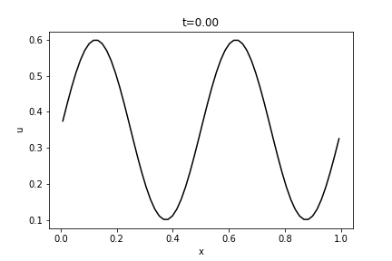
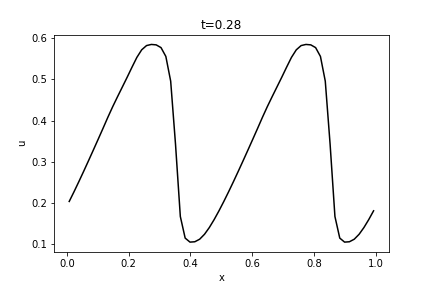
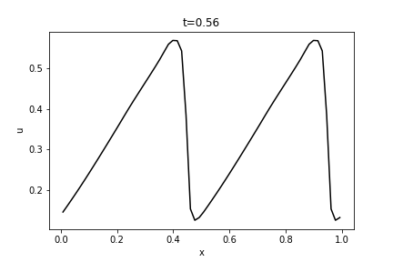
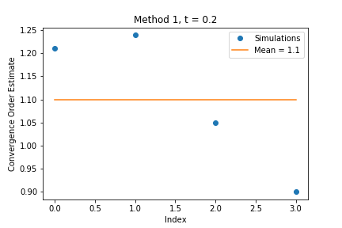
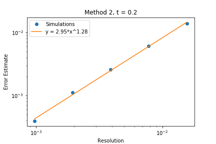
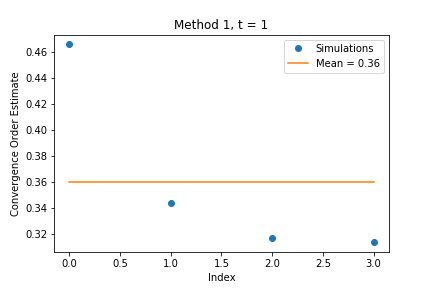
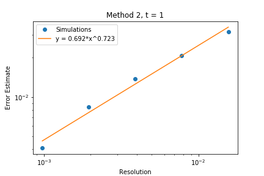
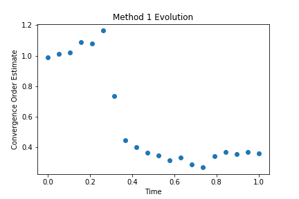
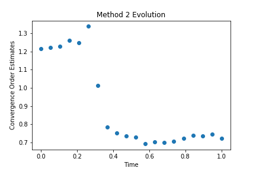

This project evolves a wave function according to Burger's equation

It is submitted as the third assignment for the 2020 Computational Physics
course at Perimeter Institute.

---

# Examples

Below are examples of the wave solution at various times.

A full animation of the evolution of Burger's equation can be found in the file animation.mp4.

# Convergence Order

The error of the solution as a function of the resolution of the discretized space is given by a power law, whose exponent is known as the _convergence order_.
In this project, two methods are used to estimate the convergence without knowledge of the true solution.
1. The first method fits an exact power law to approximate errors of the three solutions with resolutions that successively double.
The errors are approximated from the difference between consecutive solutions (the triangle inequality is turned into an equality, a controversial step indeed).
The final estimate is taken as the average of the power law parameters over multiple resolutions.
2. The second method fits a least square power law to the approximate errors of more than three solutions at various resolutions.
The errors are approximated from a solution with a resolution than all the others.

## Before Shocks

We estimate the convergence order using both methods before shocks form.

The second method gives an order of convergence of 1.28, taken from the exponent of the power law fit.

## After Shocks

We estimate the convergence order using both methods after shocks form.

The second method gives an order of convergence of 0.723, taken from the exponent of the power law fit.

## Evolution

We plot the evolution of the convergence order estimate over time using both methods.

The discontinuous drop in convergence order indicates the presence of shocks.
We conclude that this Burger's equation solver converges faster than first order before shocks form at roughly t = 0.3 and slower than first order afterward.
